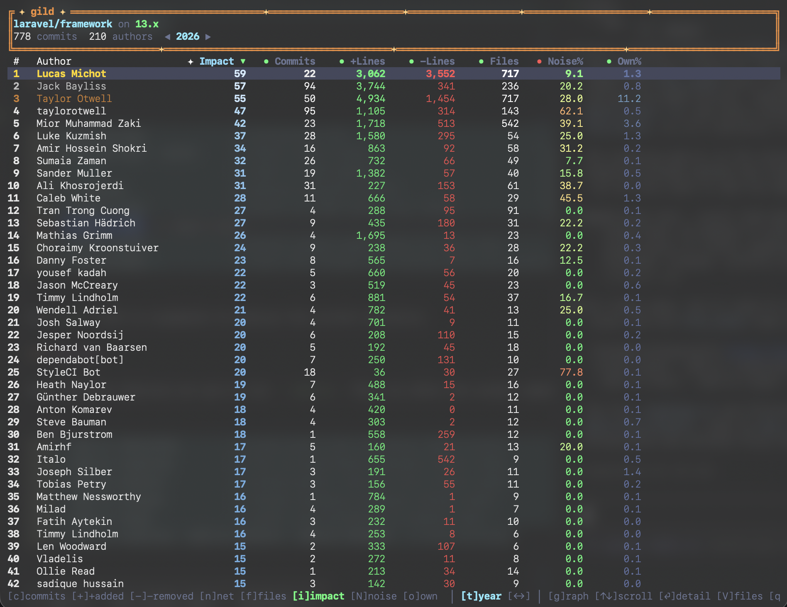
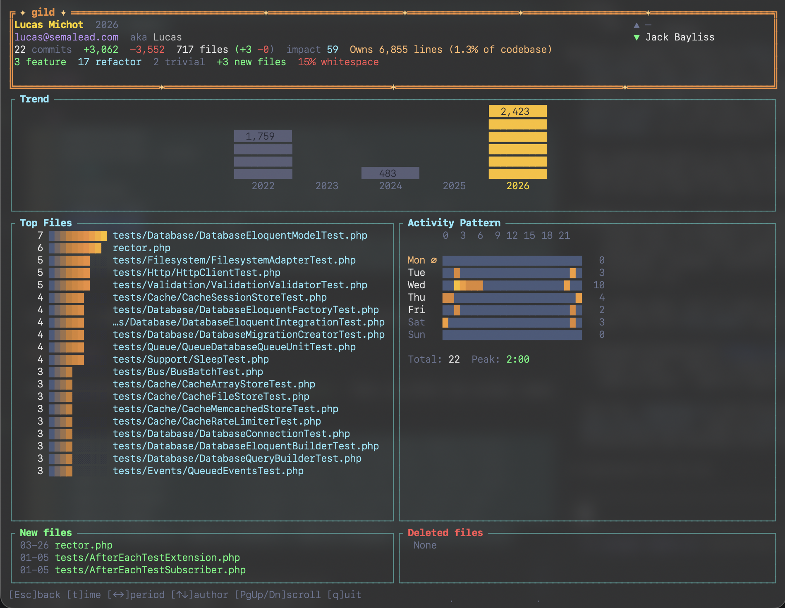
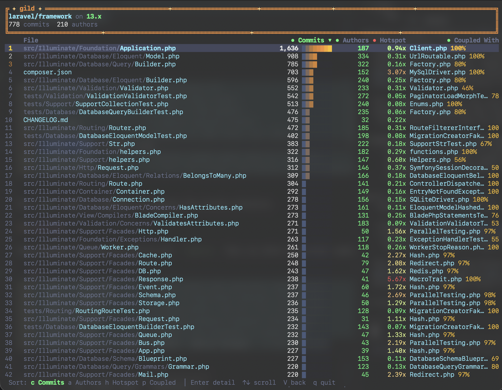

# Gild — interactive git contribution analyzer

[](https://crates.io/crates/git-gild)
[](https://github.com/corbinjurgens/gild/actions/workflows/ci.yml)
[](https://opensource.org/licenses/MIT)
[](https://www.rust-lang.org)

A terminal UI for understanding who did what in a git repository — and how much it mattered.

<p align="center">
  
</p>

<p align="center">
  
</p>

<p align="center">
  
</p>

## Why gild?

Most git analytics tools count commits or lines. Gild goes deeper:

- **Fair impact scoring** — a logarithmic formula that weighs lines, files touched, and session consistency. A single clean 200-line commit outscores a flurry of typo fixes with the same total lines. Commit splitting can't game it.
- **Identity deduplication** — union-find merges authors by email, `.mailmap`, and interactive fuzzy matching. See one entry per person, not five aliases.
- **Code ownership** — blame-based, not last-touch. Shows who wrote the code that's alive in HEAD today.
- **File coupling** — finds implicit dependencies: files that always change together.
- **Bus factor** — surfaces single-author files — your bus-factor risks.
- **Instant re-runs** — everything cached in SQLite. First run parallelizes diffs across all cores; subsequent runs load in under a second, even on 30k+ commit repos.

## Requirements

- [Rust](https://www.rust-lang.org/tools/install) 1.70+ (2021 edition)
- A C compiler (for bundled SQLite)
  - **macOS**: Xcode Command Line Tools (`xcode-select --install`)
  - **Ubuntu/Debian**: `sudo apt install build-essential pkg-config`
  - **Fedora**: `sudo dnf install gcc`
  - **Arch**: `sudo pacman -S base-devel`
  - **Windows**: Visual Studio Build Tools with C++ workload

## Install

### Via crates.io (recommended)

```sh
cargo install git-gild
```

The binary is called `gild` — that's the command you'll use after installation.

### From source

```sh
git clone https://github.com/corbinjurgens/gild.git
cd gild
cargo install --path .
```

## Usage

```sh
gild /path/to/repo              # interactive TUI
gild /path/to/repo --print      # static table output
gild -n 500                     # limit to 500 commits
gild -b develop                 # analyze specific branch
gild --export json              # export as JSON (also: csv, html)
gild --export html -o report.html
gild --clear-cache              # delete cached commit data for this repo
gild --max-threads 4            # limit CPU threads used during first-run scanning
```

Run `gild` with no arguments to analyze the current directory.

### Add-ons

Deep-analysis features are opt-in via `--add-on`. They run after the normal commit scan and cache their results — subsequent runs are instant.

```sh
gild --add-on ownership         # blame-based code ownership (Own% column)
gild --add-on coupling          # file co-occurrence analysis (Files view)
gild --add-on authors           # unique-author risk per file (Files view)
gild --add-on hotspot           # change-frequency hotspots (Files view)
gild --add-on types             # commit type breakdown in detail view
gild --add-on coupling --add-on authors --add-on hotspot   # stack multiple
```

| Add-on | Time window aware | Displayed in |
|--------|-------------------|--------------|
| `ownership` | No — blame reflects current HEAD; column hidden for historical windows | Author table (`Own%` column) |
| `coupling` | Yes | Files view |
| `authors` | Yes | Files view |
| `hotspot` | Yes | Files view |
| `types` | Yes | Detail view (commit type breakdown line) |

Legacy aliases `bus-factor`, `churn`, and `commit-types` are still accepted as drop-in replacements for `authors`, `hotspot`, and `types`.

The `coupling`, `authors`, and `hotspot` add-ons contribute to the Files view (press `V` in the TUI). Columns appear only for the add-ons that ran.

The `types` add-on enables a per-author commit classification breakdown in the detail view, categorizing commits as feature / refactor / rename / trivial / merge. Rename detection uses git's built-in rename tracking — a commit is classified as a rename when the majority of file operations are renames with modest line changes. All categories are based on knowable facts (file operations, line counts), not heuristics.

Fields that only reflect the current state of the repository (like `Own%`) automatically hide when viewing a historical time window and reappear when returning to the current period.

## TUI keys

### Table / graph view

| Key | Action |
|-----|--------|
| `c` | Sort by commits |
| `+` / `a` | Sort by lines added |
| `-` / `d` | Sort by lines removed |
| `n` | Sort by net lines |
| `f` | Sort by files changed |
| `i` | Sort by impact |
| `N` | Sort by noise % |
| `o` | Sort by ownership |
| `t` | Cycle time window (all / year / quarter / month) |
| `[` / `]` / `Left` / `Right` | Navigate time period |
| `g` | Toggle table / graph view |
| `V` | Open Files view (when coupling / authors / hotspot add-ons active) |
| `T` | Theme picker (Normal / Readable) |
| `Enter` | Detail drill-down (top files, activity heatmap, new/deleted files) |
| `j` / `k` / `Up` / `Down` | Select author |
| `Home` / `End` / `G` | Jump to top / bottom |
| `Esc` / `q` | Quit |

### Files view (requires at least one file-level add-on)

| Key | Action |
|-----|--------|
| `j` / `k` / `Up` / `Down` | Select file |
| `G` | Jump to bottom |
| `c` | Sort by commits |
| `a` | Sort by unique authors (bus factor) |
| `h` | Sort by hotspot score |
| `p` | Sort by coupling score |
| `V` / `Esc` | Return to table |
| `q` | Quit |

### Detail view

| Key | Action |
|-----|--------|
| `j` / `k` / `Up` / `Down` | Navigate between authors |
| `t` | Cycle time window |
| `[` / `]` / `Left` / `Right` | Navigate time period |
| `T` | Theme picker |
| `PageUp` / `PageDown` | Scroll detail content |
| `Home` | Scroll to top |
| `Esc` / `Backspace` | Back to table |
| `q` | Quit |

## How it works

- **Impact scoring** — measures total work substance, not commit count. The base score is `(1 + ln(1 + lines)) × (1 + 0.5 × ln(1 + total_files_changed))` computed on all lines added/removed and the sum of per-commit file counts in the window. A small consistency bonus `× (1 + 0.15 × ln(sessions))` rewards regular activity, where sessions are commit groups separated by 30-minute gaps. Both terms are log-compressed, so a single clean commit with 200 lines outscores a flurry of tiny typo-fix commits with the same total lines — commit-splitting can't inflate impact meaningfully
- **Identity deduplication** — union-find merges authors by email, `.mailmap`, and saved confirmations; an interactive questionnaire catches fuzzy matches (Levenshtein, substring, email heuristics)
- **Code ownership** (`--add-on ownership`) — runs blame (via gitoxide/imara-diff) on every non-binary file in HEAD and attributes each surviving line to its author. This is more accurate than last-touch (who last committed the file) because it measures who wrote the code that is actually alive today. Cached forever per HEAD hash. Since ownership reflects the current HEAD state, the `Own%` column is only shown when the active time window includes the present
- **File coupling** (`--add-on coupling`) — counts how often pairs of files appear in the same commit. Score = `co_occurrences / min(commit_count_a, commit_count_b)`. High-scoring pairs are implicit dependencies: change one, you likely need to change the other
- **Bus factor** (`--add-on authors`) — counts the number of distinct authors who have ever touched each file. Files touched by only one or two people are single points of failure if those people leave
- **Hotspots / churn** (`--add-on hotspot`) — measures change frequency relative to file size: `commit_count / max(1, current_line_count)`. A 20-line file touched 50 times is a hotter spot than a 2000-line file touched 50 times
- **Caching** — commit stats cached in a per-repo SQLite database by commit hash; subsequent runs are near-instant. The first scan parallelises diff computation across all CPU cores using gitoxide's imara-diff engine so even large repositories index quickly; use `--max-threads` to cap usage on shared machines. Add-on results are also cached in the same database and only recomputed when the commit history or HEAD changes. Database lives in the platform data dir (`~/Library/Application Support/gild/` on macOS), keyed by remote origin URL so local clones and remote URL inputs share the same cache
- **Memory footprint on large repos** — only numeric commit stats live in memory (~80 bytes per commit). Per-commit file paths are held in a normalized SQLite table and queried on demand by the detail view and file-level add-ons. A 1M-commit repository stays under ~100 MB resident regardless of how many files each commit touched

## Performance

Cold-run benchmark on a real-world private repository (Apple M2 Pro, 12 threads):

| | |
|---|---|
| **Commits** | 34,247 |
| **Authors** | 117 (90 after identity merge) |
| **Files in HEAD** | 18,754 |

| Phase | Time | Notes |
|-------|------|-------|
| Commit scan | 29s | Parallel diff via rayon + gitoxide |
| Cache save | 1.2s | SQLite bulk insert (commits + file paths) |
| Identity merge | 0.01s | Union-find over 117 authors |
| Ownership (blame) | 82s | Parallel blame on 18,754 files via gix-blame |
| File coupling | 0.3s | Co-occurrence matrix from commit_files |
| Authors (bus factor) | 1.4s | Distinct author count per file |
| Hotspots (churn) | 1.0s | Commit frequency / file size |
| **Total** | **115s (1.9 min)** | |

Subsequent cached runs skip the commit scan and load from SQLite in under a second. Add-on results are also cached — ownership re-runs only when HEAD changes, file add-ons only when the commit set changes.

Use `--log` to write a detailed timing log to the repo data directory.

## How merges are counted

Gild walks all commits reachable from HEAD, deduplicated by hash. Each commit is counted exactly once regardless of how many branches it's reachable through.

| Merge strategy | How it's counted |
|----------------|-----------------|
| **Regular merge** | Original branch commits keep their hashes and are attributed to the original author. The merge commit itself is separate (usually 0 lines unless conflict resolution). |
| **Fast-forward** | No merge commit created. Original commits become part of the branch as-is. |
| **Squash merge** | Original branch commits are **not** in the target history. A single new commit is created — attributed to whoever performed the merge, not the original authors. |

If your team uses squash merges, contribution data will be skewed toward the person merging. This is a git-level limitation — the original commits aren't reachable from HEAD after a squash.

## Export formats

- **JSON** — structured data with all metrics, suitable for dashboards and scripts
- **CSV** — spreadsheet-ready, one row per author
- **HTML** — self-contained Dracula-themed report with styled table

**Current limitations:** Export and `--print` only output the main author table using the "All time" window. The Files view, Graph view, and time window selection are not yet supported. The HTML export does not support client-side column sorting.

## Roadmap

- **Export view selection** — `--view` flag to export the Files view or Graph view, not just the author table
- **Export time windows** — `--time` and `--time-offset` flags so exports can target a specific period (year, quarter, month)
- **Sortable HTML export** — client-side JavaScript so column headers are clickable for sorting

<details>
<summary><strong>Architecture</strong></summary>

| File | Role |
|------|------|
| `main.rs` | CLI via clap, orchestration |
| `storage.rs` | Per-repo data dir resolution, atomic file writes |
| `db.rs` | SQLite connection, schema migrations |
| `git.rs` | Three-phase commit loader via gitoxide: pre-count, cache check, parallel diff (rayon + imara-diff) |
| `cache.rs` | SQLite-backed commit stats + file path cache |
| `identity.rs` | Union-find identity merging |
| `ownership.rs` | Blame-based code ownership via gix-blame |
| `coupling.rs` | File co-occurrence matrix |
| `bus_factor.rs` | Unique authors per file |
| `churn.rs` | Change frequency / file size hotspot scoring |
| `app.rs` | Core state machine: sorting, time windows, impact scoring, views |
| `ui/` | Ratatui TUI: event loop, Dracula theme, table/graph/detail/files views |
| `export.rs` | JSON, CSV, HTML export |

</details>
